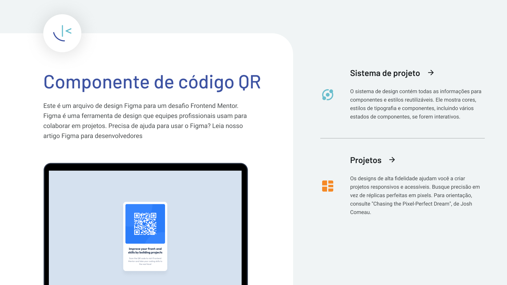

# Desafio de Componente de Código QR

Este é um projeto simples de componente de código QR, feito como parte de um desafio do Frontend Mentor. O objetivo principal foi recriar um design proposto e aprimorar habilidades básicas de front-end.

## O Desafio

O desafio era construir um componente de código QR e fazê-lo se parecer o mais próximo possível do design original fornecido pelo Frontend Mentor.

### O que foi aprendido

- **HTML e CSS Semânticos:** Organização da estrutura da página usando tags HTML apropriadas.
- **Flexbox e Box Model:** Utilização de `display: flex` para centralizar elementos e domínio do `box model` para espaçamento e dimensão.
- **Transições e Efeitos CSS:** Aplicação de efeitos `hover` e `active` para melhorar a experiência do usuário.
- **Otimização de CSS:** Utilização do `clean-css` para minificar o arquivo CSS, reduzindo o tamanho do arquivo e melhorando o tempo de carregamento.
- **Manipulação do DOM com JavaScript:** Uso do JavaScript para criar a funcionalidade de um menu de idiomas dinâmico, que aparece e desaparece com um clique.
- **Tradução:** Implementação de um sistema de tradução.

## Tecnologias Utilizadas

- **HTML5** (Semântico)
- **CSS3** (com Flexbox)
- **JavaScript** (Manipulação do DOM)
- **Google Fonts** (Fonte 'Outfit')
- **clean-css** (para minificação do CSS)

## Como Usar

1.  Clone o repositório em sua máquina local.
2.  Abra o arquivo `index.html` no seu navegador.

## Links Úteis

- **Solução no GitHub Pages:** (Coloque aqui o link do seu projeto hospedado no GitHub Pages)
- **Link do Desafio:** [https://www.frontendmentor.io/challenges/qr-code-component-iux_sIO_x](https://www.frontendmentor.io/challenges/qr-code-component-iux_sIO_x)
- **Meu Perfil no Frontend Mentor:** [https://www.frontendmentor.io/profile/EmersonRomana](https://www.frontendmentor.io/profile/EmersonRomana)

## Autor

**Emerson Romana**
